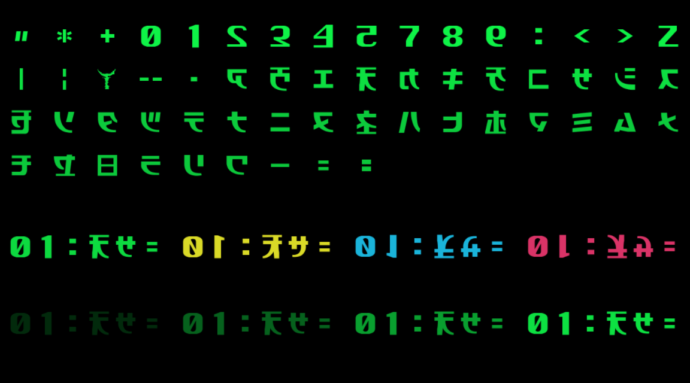

# Matrix Reflow on Linux

Iteration 1 builds a native C99/C++17 application with a FreeType atlas and
a shared OpenGL 3.3/GLX renderer; XScreenSaver integration belongs to iteration 2.
See [implementation plan](implementation-plan.md) and [study](study.md).

The default window is a **static glyph lab**, not animated rain yet. It uses the
same `Renderer::draw_instances()` entry point, font texture and GLSL shaders that
will receive simulation output in iteration 2.



Top: all 57 glyphs in atlas order. Middle: normal, X-flipped, Y-flipped and
X+Y-flipped samples (green, yellow, cyan, pink). Bottom: brightness 0.2/0.4/0.6/0.8.
Some characters are inherently reversed in the original font; those outlines
are preserved. The screenshot is a lossless PNG conversion of GPU readback.

## Build

The following development packages were verified installed on AlmaLinux 10.2:
`gcc gcc-c++ cmake make pkgconf-pkg-config libX11-devel libepoxy-devel freetype-devel`.
OpenGL 3.3 via GLX is the rendering baseline. No Windows SDK is required.

From the repository root:

```sh
cmake -S Linux -B build/linux -DCMAKE_BUILD_TYPE=Debug
cmake --build build/linux --parallel
ctest --test-dir build/linux --output-on-failure
./build/linux/matrix-reflow
```

Use a separate build directory with `-DCMAKE_BUILD_TYPE=Release` for optimized
builds. CPU tests require no display. Missing development dependencies fail at
configure time. Build artifacts stay outside source control.

## Atlas inspection

`./build/linux/matrix-reflow --dump-atlas /tmp/matrix-atlas.pgm` writes a top-down
8-bit image without opening X11. The font is built into the executable; its bytes
come from `windows/Matrix-Code.ttf`. Generated headers live in the build tree.
The renderer applies per-instance flips; the atlas itself is not mirrored.

## GLX control scene and checks

Run `./build/linux/matrix-reflow --control` for the windowed control scene.
Escape or window close exits. Use `--frames 2 --capture /tmp/control.ppm` for
a bounded run and capture. Shader/font data is embedded, so cwd does not matter.
`--hidden` leaves the program's own window unmapped for automated checks.

`./build/linux/graphics-test` explicitly runs graphics tests on the current
DISPLAY. It never targets other applications. To include it in CTest configure
with `-DREFLOW_GL_TESTS=ON`; otherwise CTest runs only display-independent tests.
`glyph-render-test` additionally checks all 57 glyphs in four flip modes against
the CPU atlas, including colors and alpha. It also runs with this CTest option.
A suitable Xvfb display with GLX can be used for software rendering; this does
not replace testing the actual GPU or, in iteration 2, XScreenSaver preview.

## Install for local testing

```sh
cmake --install build/linux --prefix "$HOME/.local"
```

This installs only `bin/matrix-reflow`. It does not register a screensaver,
change startup files or start a daemon. XScreenSaver XML and integration are in
iteration 2. The executable can also be run directly from the build directory.

## Current limits

The GLX host currently owns its window; borrowed XScreenSaver windows come next.
The glyph lab is static, with SDR output and no bloom/CRT. Windows visual parity
has not been claimed. Rendering uses top-down atlas UVs, OpenGL clip conventions,
premultiplied scene blending and an opaque final composite. Font mipmaps stop at
level 3 to retain integral cell boundaries. This filtering choice will be revisited
with small animated glyphs during iteration 2.
