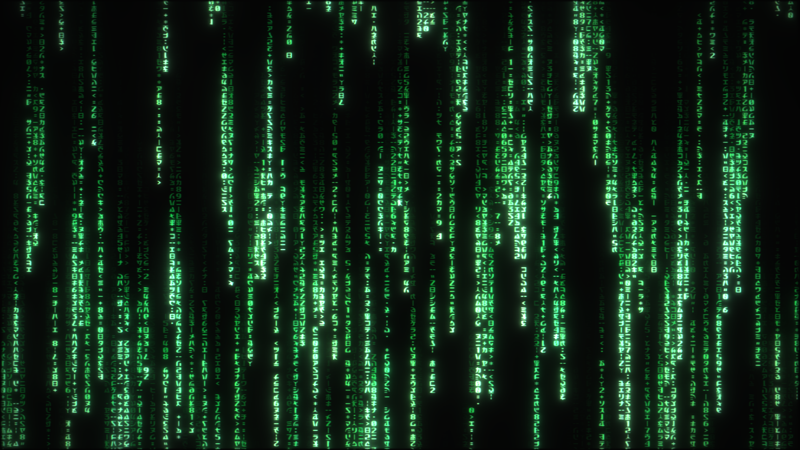

# Matrix Reflow — Linux / OpenGL

Matrix digital rain for **Linux and XScreenSaver**, ported from
[Delmay441/Matrix-Reflow](https://github.com/Delmay441/Matrix-Reflow).
This fork adds an X11/GLX renderer with OpenGL 3.3, an embedded FreeType glyph
atlas, multiscale bloom, optional CRT emulation, and configuration through
XScreenSaver’s existing **Settings** and preview windows.



The rain simulation uses the shared C99 `mmcore` engine. Standalone windows,
XScreenSaver previews and the full-screen effect use the same renderer.
XScreenSaver handles activation and screen locking; Matrix Reflow draws the effect.

## Linux quick start

Tested on AlmaLinux 10.2 / X11 / Window Maker with Intel HD Graphics 620.
Build dependencies: a C/C++ compiler, CMake, pkg-config, X11, libepoxy,
FreeType and GLib development packages; Python 3 for registration and tests.

```sh
cmake -S Linux -B build/linux -DCMAKE_BUILD_TYPE=Release
cmake --build build/linux --parallel 2
./build/linux/matrix-reflow --windowed
```

For a locally installed XScreenSaver under `/usr/local`:

```sh
sudo cmake --install build/linux --prefix /usr/local
python3 Linux/xscreensaver/register.py
xscreensaver-settings
```

Select **Matrix Reflow**, then use **Settings** for rain, camera, colors, bloom,
CRT and frame-rate controls. There is no separate GTK configuration application.
Registration preserves existing effects and preferences. Installation does not
start a daemon or lock the screen. Other installation layouts are described in
the [Linux build and usage guide](Linux/README.md).

## Linux status

Iterations 1–5 are implemented and merged: build/font/GLX, animated rain and
XScreenSaver embedding, bloom, CRT, and configuration/install integration.
Short CPU/GLX regression checks, staged installation and actual XScreenSaver
previews have passed. Long endurance runs, additional hardware and physical
multi-monitor testing remain outstanding. Windows visual parity is not claimed;
Linux output is SDR, and native Wayland is outside this port.

- [Linux guide and command-line options](Linux/README.md)
- [Work-in-progress release notes](Linux/CHANGELOG-WIP.md)
- [Validation results and limitations](Linux/validation.md)
- [Iteration plan and milestones](Linux/implementation-plan.md)
- [Original feasibility study](Linux/study.md) — historical planning document

Our separate [XScreenSaver fork](https://github.com/Hans-Einar/xscreensaver)
contains the optional green Phosphor/Matrix unlock dialog. It is independent
of this effect: Matrix Reflow also works with an unmodified XScreenSaver.

## Origin and credits

- **Direct upstream:** [Matrix-Reflow by Delmay441](https://github.com/Delmay441/Matrix-Reflow),
  providing the rain behavior, shared simulation, embedded Matrix-Code font and
  Windows rendering/effects used as the Linux reference.
- [ModernMatrixScreensaver by DigitalChewie](https://github.com/DigitalChewie/ModernMatrixScreensaver),
  the project from which Matrix-Reflow was forked and the source of the shared engine.
- [Matrix by Rezmason](https://github.com/Rezmason/matrix), credited by upstream
  for the Matrix-Code font and visual inspiration.
- [XScreenSaver by Jamie Zawinski and contributors](https://www.jwz.org/xscreensaver/),
  including GLMatrix, the earlier effect in this lineage and our Linux host.

The Linux work is maintained in [Hans-Einar/Matrix-Reflow](https://github.com/Hans-Einar/Matrix-Reflow).
Upstream Git history and Windows sources are retained. This repository is a
separate GitHub repository with preserved history because the account already
has a fork in the ModernMatrixScreensaver network; see the study for details.
Existing copyright notices remain in place. No new license is asserted for
inherited code or the font; the study records the unresolved font/license provenance.

## Original Windows version

The inherited Windows 10/11 version uses Direct3D 11 and DirectWrite, with bloom,
HDR support and optional CRT emulation. The instructions below describe that
upstream implementation; Linux validation does not validate Windows builds.
For upstream development, see [Delmay441/Matrix-Reflow](https://github.com/Delmay441/Matrix-Reflow).

### Requirements

- Windows 10 or 11, x64
- A Direct3D 11–capable GPU
- To build: Visual Studio Build Tools 2022 with the "Desktop development with C++" workload (for `cl.exe`, `rc.exe`, and `fxc.exe`)

### Building

Everything is driven by `windows/build.ps1`, which locates your MSVC install via `vswhere`, precompiles the HLSL shaders offline with `fxc.exe` into C arrays (so nothing is compiled at runtime), and links a single self-contained `MatrixReflow.scr` — an ordinary Win32 PE just renamed with a `.scr` extension.

```powershell
windows\build.ps1              # build windows\MatrixReflow.scr
windows\build.ps1 -Test        # build + run the mmcore link-test (sanity check, no .scr)
windows\build.ps1 -Run         # build, then launch full-screen (/s)
windows\build.ps1 -Configure   # build, then open the settings dialog (/c)
windows\build.ps1 -Shot        # build, then render a headless PNG (windows\build\shot.png)
windows\build.ps1 -Clean       # remove build artifacts
```

There's nothing to ship at runtime beyond the `.scr` itself — the font is embedded and the shaders are precompiled.

### Installing

**As your own screensaver (no admin required):**

```powershell
windows\install.ps1
```

Copies `MatrixReflow.scr` to `%LOCALAPPDATA%\MatrixReflow`, points your screensaver settings at it, and applies the change immediately. Your previous screensaver choice is remembered.

```powershell
windows\uninstall.ps1
```

Removes it and restores whatever screensaver you had before.

**To also list it in the classic "Screen Saver Settings" dropdown for all users** (elevated prompt required):

```powershell
windows\install-systemwide.ps1
```

Then open `control desk.cpl,,@screensaver` and pick **Matrix Reflow**.

### Usage

Like any `.scr`, it responds to the standard screensaver command-line switches:

| Switch | Behavior |
| --- | --- |
| `/s` | Run full-screen (the real screensaver) — one window per monitor, exits on any input |
| `/p <HWND>` | Preview inside a given parent window (the small preview box) |
| `/c[:<HWND>]` | Open the settings dialog |
| *(none)* | Same as `/c` |
| `/w` | Run in a normal resizable window (development / screenshots) |
| `/shot <path.png> [frames] [w] [h]` | Headless render to a PNG, no window shown |

Settings and profiles are stored per-user under `HKCU\Software\Chewie\MatrixReflow`. Logs are written to `%LOCALAPPDATA%\MatrixReflow\MatrixReflow.log` (append-across-runs, rotated past ~1 MB) — useful since a screensaver has no console of its own.

### How it's built

- **Renderer** — Direct3D 11, with a glyph pass, a bloom chain (threshold → downsample/upsample mip chain → composite), and an optional CRT emulation filter, all as precompiled shader blobs baked into the binary.
- **Glyph atlas** — an embedded font rasterized once at startup into an R8 mip-mapped texture via a private, in-memory DirectWrite font collection (no OS-wide font install or registration), falling back to Arial if that path is unavailable.
- **Simulation core (`mmcore`)** — portable C99 owning the rain simulation, settings model, and glyph-instance layout; rooted in the same engine as the macOS build, though Matrix Reflow's settings and behavior have since diverged from it.
- **Settings dialog** — a native Win32 tabbed dialog (sliders, color pickers, presets, profile management) with a live preview pane.
- **Host shell** — a small Win32 shell that parses the standard screensaver switches, manages one window/renderer per monitor in full-screen mode, and paces frames to the display's refresh rate (VRR-aware).
